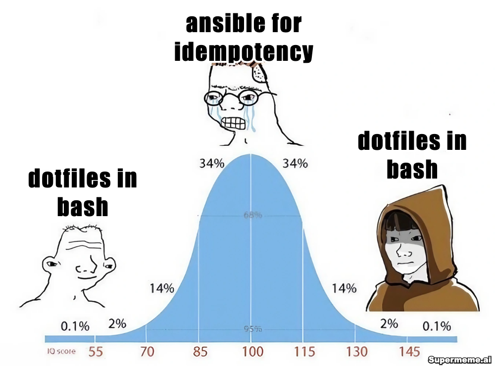

# dotfiles-playbook (archived)

> **This repo has been archived.** My dotfiles now (once again) live at [adambware/dotfiles](https://github.com/adambware/dotfiles).

I started with bash scripts, moved to Ansible, and have come full circle back to bash scripts. It was a fun ride.

## thanks

I took quite a few ideas from [Zach Holman](https://github.com/holman)'s clever [dotfiles](https://github.com/holman/dotfiles).
Also found some great work over at [thoughtbot](https://github.com/thoughtbot/) from their [laptop](https://github.com/thoughtbot/laptop) setup script.
Most OS X tweaks came from the amazing [.osx](https://github.com/mathiasbynens/dotfiles/blob/master/.osx) created by [Mathias Bynens](https://github.com/mathiasbynens).
